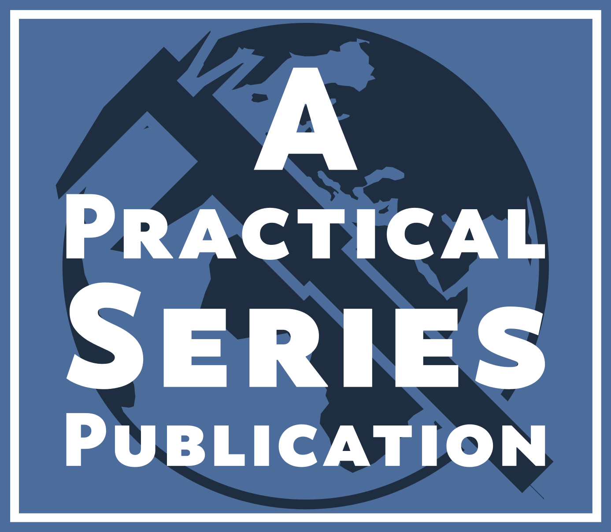

# &copy; Practical Series of Publications

###### A series of technical documents for engineers (and others)

# A Downloadable Website Template for Online Publications 

    

This is the downloadable version of a template for the publication of web based books and documents.

The template as it stands is an empty framework (it contains a few notes and examples) designed to hold whatever document or publication is directed at it. It’s well set out, has a range of nice and consistent styles and navigations that can be used with almost no effort. 

There is a whole website that provides very detailed information about the construction of the website template and how to use it. You can access it at:

[practicalseries.com](https://www.practicalseries.com/1001-webdevelopment/index.html)

The website also contains a full tutorial for learning how to build a website and covers HTML and CSS in considerable detail as well as providing a primer to JavaScript and jQuery and how to access and use various plugging applications that are useful.

The site is comprehensive, assumes no previous knowledge and is easy to understand. I apologise in advance for my sense of humour.

This website template is free to use and is made available under the MIT License.

## Revision information

The master branch only contains either finished publishable work or a completed and released website. 

Publishable work is a section of the website that is complete in itself—it does not indicate that the whole website is finished, just that the section in question is complete, tested and deployable.

Development work always takes place on a separate branch. Development branches always spur from some published or released point on the master branch.

**The current published and development status is:**

| Branch             | Revision
| ------------------ | --------------------------------------
| master             | 

## Contents

The template itself is a website prototype that is designed to hold whatever document or publication is directed at it. It’s well set out, has a range of nice and consistent styles and navigations that can be used with almost no effort.

The template uses a responsive design to display information on a webpage.

This downloadable version of the website template is a basic set of pages and supporting files. 

It is equipped with eight web pages installed by default in a user friendly directory structure. These files are accompanied by the various and supporting CSS, JavaScript and jQuery files. 

To summarise it contains the following:

| HTML files          | Page                | Description
| ------------------- | ------------------- | -------------------
| index.html          | Landing page        | This section is the first page of the website, it is the landing page for the domain
| 01-00-intro.html    | Introduction        | A basic introduction to the template, a summary of its contents and a brief guide to using the template
| 01-02-intro.html    | Introduction        | An introduction to the online guide explaining the construction and workings of the template
| 02-00-example.html  | Example page 1      | An example page showing a formally populated chapter part 1
| 02-02-example.html  | Example page 2      | An example page showing a formally populated chapter part 2
| 80-00-fianally.html | Contacts, legal &c. | The finals section: contacts, acknowledgements, colophon, legal, licence and privacy &c
| 90-00-blank.html    | An empty section    | An empty section that can be copied and reused as required
| 98-00-typicals.html | Typical examples    | Typical examples of the different components that can be used within the website: figures, lightbox, tables, formula, code &c

The template also includes all the other CSS and JS files needed to make it work.

The template uses various open source fonts (all contained within the download) to display the text on the web pages.

The download also contains various third party software files that perform specific functions: lightbox gallery for images, displaying code fragments and equations, hyphenating text &c.

## Installation

The website template can be downloaded as a zip file complete with all files and the website directory structure from the following link:

[Practical Series Website Template](https://www.practicalseries.com/1001-webdevelopment/11-resources/04-data/web-template.zip)

## The TEMPLATE licence

The website template: its contents, format, structure, documentation and source code, I make available to all who wish to use it. It is available under the MIT Licence.

## Workflow status

The following shows the project status as workflow diagrams:

